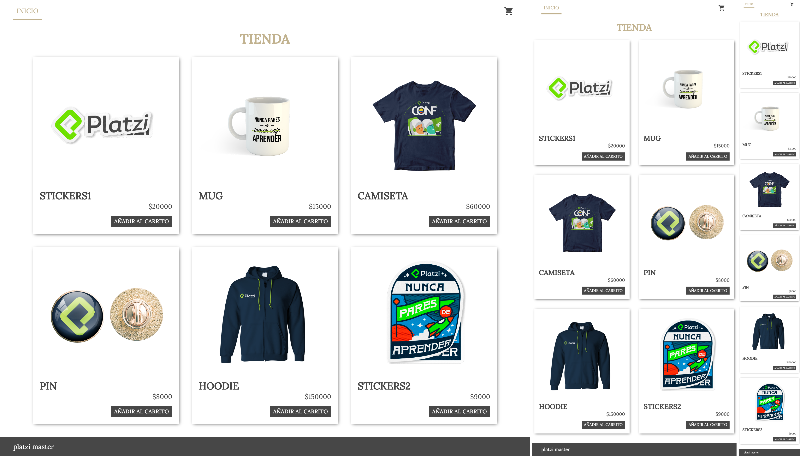

# tienda-virtual
Realizar landing de tienda virtual(Añadir a carrito, ver detalle del producto, tener una cuadricula de productos)  Requisito: Utilizar JS Vanilla, CSS Grid, Responsive, Preprocesador y Metodología CSS

## screenshot

## Developed for

[Platzi Master](https://platzi.com)

## Used tools

1. HTML5

2. SCSS

3. Ecmascript 6

## credits

> Platzi Master